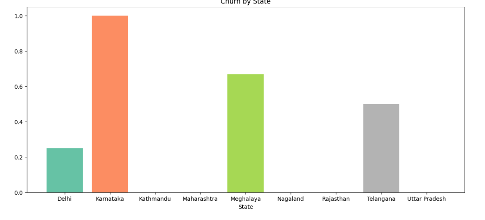
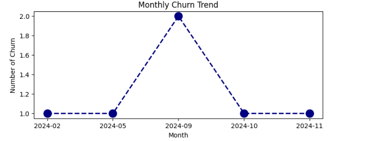
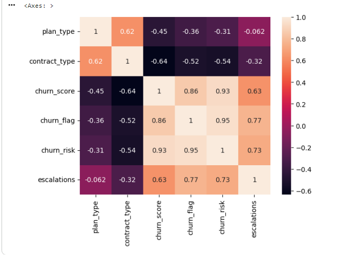
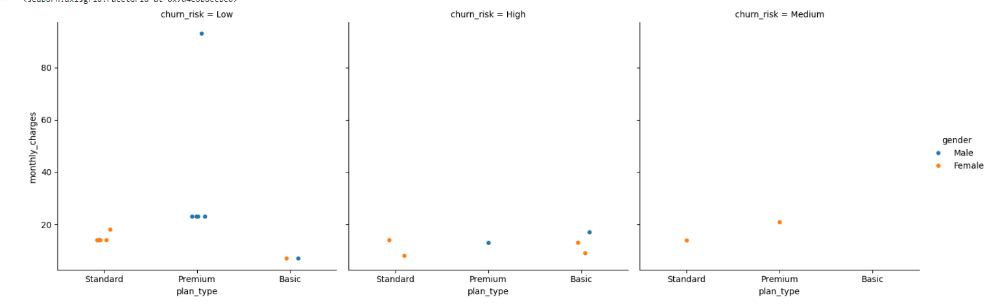

# Churn Analysis & Customer Intelligence

## 📊 Project Overview
In the hyper-competitive OTT subscription landscape, retaining subscribers is the ultimate driver of sustainable growth. This project serves as an end-to-end data analytics pipeline designed to identify high-risk subscribers, quantify revenue leakage, and deliver a data-backed contract-migration strategy. By integrating multi-table subscriber data across customer demographics, subscription metrics, and support logs, this analysis translates raw relational data into highly actionable executive insights.

## 🛠️ Tech Stack & Architecture
* **Language:** Python 3
* **Libraries:** Pandas, NumPy, Matplotlib, Seaborn
* **Database Engine:** SQLite (`sqlite3`)
* **Environment:** Google Colab / Jupyter Notebook

### 🗄️ Relational Database Schema
The pipeline extracts data from three interconnected tables inside the `customer_churn` database:
* **`db_customer`**: Demographics (Customer ID, Name, Country, State, Gender, DOB, Interests, Pincode)
* **`db_subscription`**: Financial & Billing Metrics (Subscription Dates, Tiers, Contract Types, Charges, CLTV, Churn Score)
* **`db_support`**: Behavioral Signals (Complaint Dates, Escalations, CSAT Scores, Comments)

---

## 🚀 Key Business Insights & KPI Summary

* **Overall Attrition:** The platform faces a **28.6% Churn Rate**, maintaining a **71.4% Retention Rate**.
* **The Monthly Contract Leak:** Monthly-contract subscribers churn at a staggering **55.6%**, which is **6.7 times higher** than the annual contract churn rate (**8.3%**). 
* **Financial Erosion:** Attrition accounts for an **18% total revenue loss** (₹74/month in active MRR leakage) and has triggered **₹2,047 in total CLTV erosion** across high-risk cohorts.
* **Basic Plan Vulnerability:** The vast majority of subscriber losses originate from the Basic Subscription Plan, limiting massive, immediate top-line impacts but highlighting a heavy volume deficiency.

---

## 📈 Data Visualizations & Deep Dive

### 1. Geographic & Temporal Vulnerabilities
Our analysis isolated a severe, highly localized churn event. The data reveals that **Karnataka** experienced a critical **100% churn rate anomaly** (a complete subscriber loss in the dataset), which directly aligns with a sharp macro spike in overall churn volume during **September 2024 (2024-09)**.

| Churn by State | Monthly Churn Trend |
| :---: | :---: |
|  |  |

* **Strategic Takeaway:** This sudden intersection points heavily toward localized infrastructure issues, regional competitor pricing campaigns, or aggressive operational modifications specific to the Karnataka region in September.

---

### 2. Behavioral Signals & Correlation Matrix
By computing a multi-variable correlation matrix, we validated the operational metrics that act as early warning indicators for subscriber loss.

* **Strategic Takeaway:** Unresolved customer support **escalations show a powerful positive correlation ($0.77$) with actual customer churn**. Furthermore, the platform's internal `churn_risk` scoring engine perfectly mirrors final churn flags ($0.95$), proving its operational reliability for automated proactive campaigns.

---

### 3. Pricing Tier vs. Risk Distribution
A granular breakdown reveals how monthly billing structures distribute across low, medium, and high-risk subscriber segments segmented by plan types.

---

## 💡 Strategic Action Plan & Next Steps

1. **Targeted Contract Migration:** Launch an automated promotional campaign offering short-term billing incentives to high-risk **Monthly** subscribers if they transition to an **Annual** structure, leveraging their $6.7\times$ lower probability to churn.
2. **Operational Regional Audit:** Investigate localized technical complaints, billing failures, or competitor initiatives in **Karnataka** around the **September 2024** window to address the root cause of the 100% churn spike.
3. **Proactive Support Prioritization:** Establish a high-priority customer success queue by filtering active subscribers with a `churn_score > 70` who have open support `escalations` and high `CLTV`. Reach out via automated or direct channels before the billing cycle ends.

---

## 👨‍💻 Author
**Aman**  
*Data Analyst*  
[Your LinkedIn Profile Link] | [Your Portfolio Website Link]
